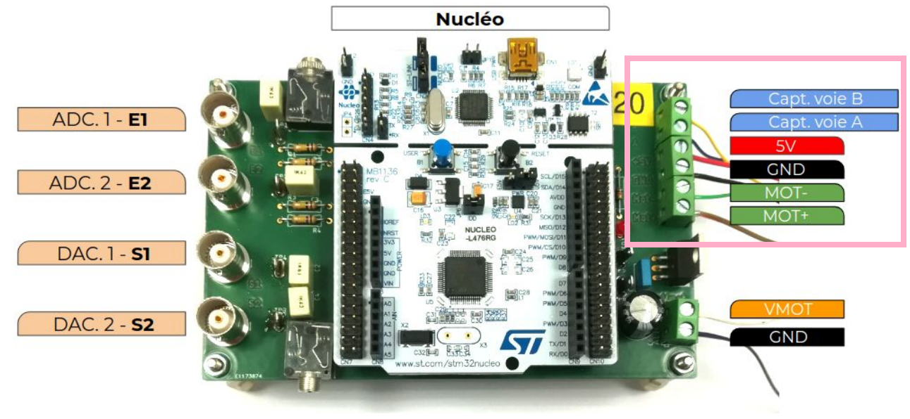
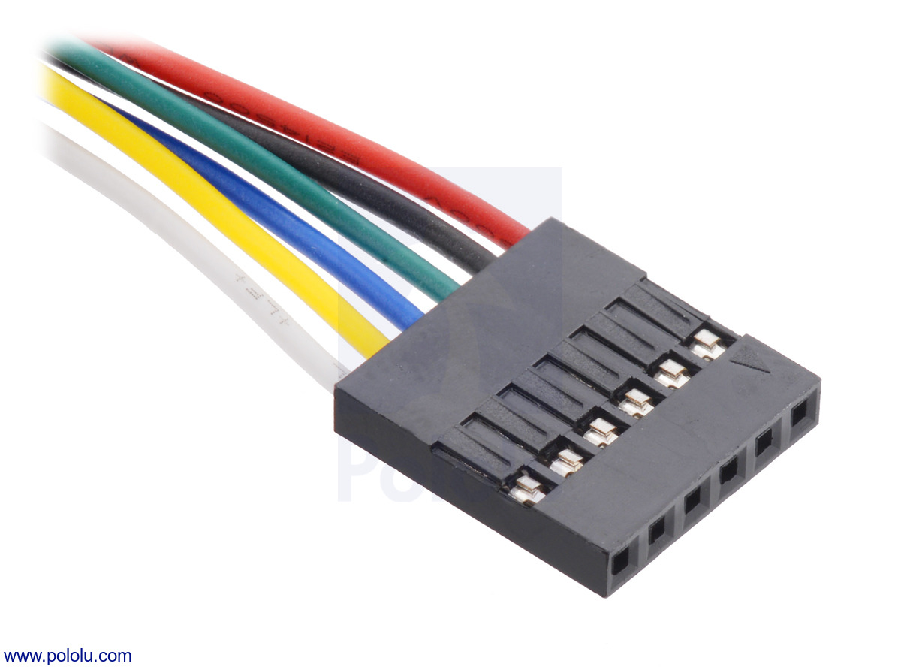

TUNIS board description
=======================

Signal processing
-----------------

In this section, the **signal processing** part of the board will be described.

   
   TUNIS board - Analog inputs and outputs

.. warning::
   Analog and digital inputs of a STM32 microcontroller (included on the Nucleo board) operate on voltages between **0 and 3.3V**. Otherwise inputs can lead to severe damages.

.. flat-table:: Pinout of the TUNIS Board
   :widths: 20 20 30 20
   :header-rows: 1

   * - Function
     - Label
     - Type
     - Pinout on Nucleo
   * - Analog Input 1
     - E1 / EA0
     - Analog or Digital Input 
     - PA_0 / A0 
   * - Analog Input 2
     - E2 / EA1
     - Analog or Digital Input
     - PA_1 / A1 
   * - Analog Output 1
     - S1 / DAC1
     - Analog or Digital Output
     - PA_4 / A2
   * - Analog Output 2
     - S2 / DAC2
     - Analog or Digital Output
     - PA_5 / D13
	 
.. warning::
   When the analog output S2 is in use, **LED1** on the Nucleo board becomes unavailable (it is also connected to D13 or PA_5).

All other pins on the Nucleo board remain available for your application and can be connected directly to the Arduino or Morpho connectors.

DC Motor position control
-------------------------

In this section, the **DC motor position control** part of the board will be described.

   
   TUNIS board - DC motor connector

Pinout of the Nucleo board
~~~~~~~~~~~~~~~~~~~~~~~~~~

.. flat-table:: Pinout of the TUNIS Board
   :widths: 20 20 30 20
   :header-rows: 1

   * - Function
     - Label
     - Type
     - Pinout on Nucleo
   * - PWM 1
     - PWM 1
     - Digital Output 
     - PB_6 / D10
   * - PWM 2
     - PWM 2
     - Digital Output 
     - PC_7 / D9
   * - Motor Error (Driver)
     - EF
     - Digital Input 
     - PA_7 / D11
   * - Encoder Channel A
     - SA
     - Digital Input 
     - PB_8 / D15
   * - Encoder Channel B
     - SB
     - Digital Input 
     - PB_9 / D14

Connection to the motor
~~~~~~~~~~~~~~~~~~~~~~~

During labworks, **Pololu** DC motor (*3239* or *4843*) are used.  This gearmotor consists of a **12 V** brushed DC motor combined with a 20.4:1 metal gearbox. A 48 CPR quadrature encoder is integrated on the motor shaft. It provides 979.62 counts per revolution of the gearbox’s output shaft.
 

More documentation is available at the `Pololu website <https://www.pololu.com/>`_ : `POL3239 <https://www.pololu.com/product/3239>`_ or `POL4843 <https://www.pololu.com/product/4843>`_

   
   Pololu DC motor connector - From pololu.com

.. flat-table:: Pololu DC motor connector - From pololu.com
   :widths: 20 30
   :header-rows: 1

   * - Color
     - Function
   * - Red
     - Motor power (connected to one motor terminal)
   * - Black
     - Motor power (connected to the other motor terminal)
   * - Green
     - Encoder GND
   * - Blue
     - Encoder VCC (5V)
   * - Yellow
     - Encoder A output
   * - White
     - Encoder B output

Power supplies
~~~~~~~~~~~~~~

.. caution::
   Pololu motors *3239* and *4843* support a voltage until 12V.