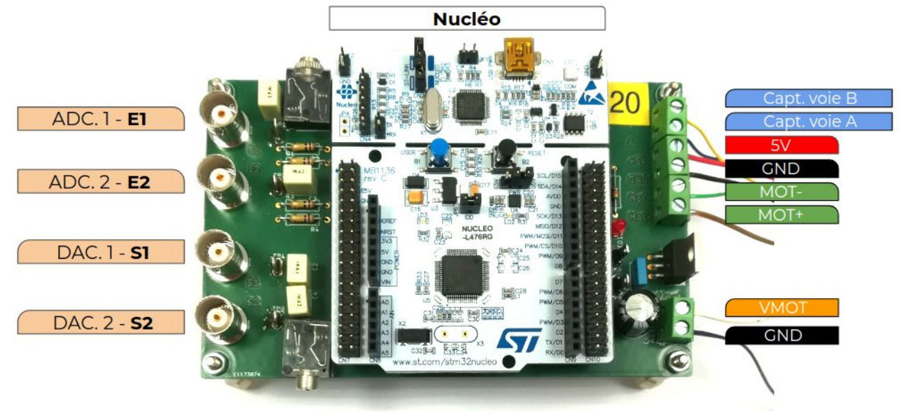

.. TUNIS board documentation master file, created by
   sphinx-quickstart on Fri Dec 15 11:17:25 2023.
   You can adapt this file completely to your liking, but it should at least
   contain the root `toctree` directive.

TUNIS extension board documentation
===================================

.. caution::
   This application and its documentation website are still works in progress

**TUNIS board** is an extension board for Nucleo microcontroller board. It facilitates connections between a Nucleo board and other components (as function generators, oscilloscopes, DC motor...).

It was developed for covering two main applications in the engineer training proposed at the *Institut d'Optique* :

* audio signals processing (in stereo mode)
* DC motor control (position or speed control)

   
   TUNIS board developed by LEnsE and ENS Paris-Saclay

In our case, a *Nucleo L476RG* board from *STMicroelectronics* is used. The STM32 microcontroller is programmed using **Arm Keil Studio** (and MBED-OS library). 

The GitHub repository of this project : `tunis-board <https://github.com/IOGS-LEnsE-platforms/tunis-board>`_

|

A set of tutorials for MBED-OS and Nucleo boards are available on the LEnsE website : `Nucleo and MBED-OS Tutorials <https://lense.institutoptique.fr/prototyper-avec-nucleo-et-mbed-tutoriels-a-la-carte/>`_

GUI Tutorials
-------------

.. toctree::
   :maxdepth: 1
   :caption: Board description
   
	Description<contents/board_description>
	Schematics<contents/schematics>
	Test procedures<contents/procedures>

.. toctree::
   :maxdepth: 1
   :caption: Board test procedures
	Test procedures<contents/procedures>
   
   
http://lense.institutoptique.fr/ressources/MINE/Notices/MaterielLense/Carte_TUNIS.pdf

About the LEnsE
---------------

This is a test.
